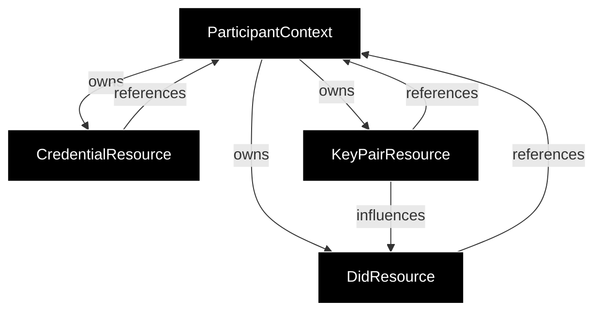
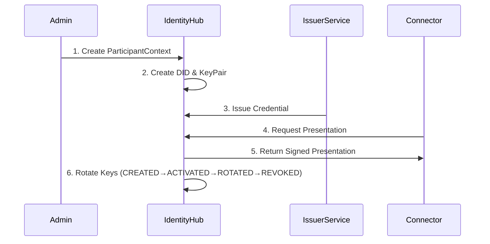

# IdentityHub Data Models

This document provides an overview of the core data models in the IdentityHub component, based on the upstream **Eclipse EDC IdentityHub** project.

## Table of Contents

1. [Core Data Models](#core-data-models)
   - [ParticipantContext](#1-participantcontext)
   - [CredentialResource](#2-credentialresource)
   - [KeyPairResource](#3-keypairresource)
   - [DidResource](#4-didresource)
2. [Relationships](#relationships)
3. [Data Flow](#data-flow)
4. [Additional Information](#additional-information)

---

## Core Data Models

The IdentityHub manages several interconnected entities that work together to provide comprehensive identity and credential management functionality:

### 1. ParticipantContext

The `ParticipantContext` (specifically `IdentityHubParticipantContext`) represents a dataspace participant and serves as the top-level organizational unit.

* **Purpose:** Serves as the primary organizational entity that owns and manages all other resources (credentials, DIDs, key pairs) for a specific participant.
* **Lifecycle Events:**
  
* `ParticipantContextCreated`: Emitted when a new context is created.
* `ParticipantContextUpdated`: Emitted when context properties change.
* `ParticipantContextDeleting`: Emitted before deletion to allow cleanup.

### 2. CredentialResource

The `CredentialResource` represents a verifiable credential stored in the IdentityHub.

* **Purpose:** Stores and manages verifiable credentials received from issuers, enabling participants to hold and present credentials during **DCP (Decentralized Claims Protocol)** flows.

### 3. KeyPairResource

The `KeyPairResource` represents a cryptographic key pair used for signing and verification operations.

* **Purpose:** Manages cryptographic key pairs for signing credentials and presentations. Supports key rotation and comprehensive lifecycle management.

#### Lifecycle States

| State | Code | Description |
| :--- | :--- | :--- |
| **CREATED** | 100 | Key pair created in database but not yet active. Private key in vault. |
| **ACTIVATED** | 200 | Actively used for signing. Public key added to the DID document. |
| **ROTATED** | 300 | Can still verify signatures but cannot sign new ones. Transitional state. |
| **REVOKED** | 400 | Completely retired. Verification method removed from DID document. |

### 4. DidResource

The `DidResource` wraps a DID Document and represents its lifecycle in the IdentityHub.

* **Purpose:** Manages DIDs and their corresponding DID Documents, which contain public keys, service endpoints, and other metadata.
* **Lifecycle:** DID Documents are automatically updated when `KeyPairResources` are activated or revoked.

---

## Relationships

**Key Relationships:**
- **ParticipantContext** owns all resources (credentials, key pairs, DIDs) for a dataspace participant
- Each **CredentialResource**, **KeyPairResource**, and **DidResource** references their owning **ParticipantContext**
- **KeyPairResource** influences **DidResource** by adding/removing verification methods during key lifecycle transitions
- All entities are scoped to a single participant context for multi-tenancy isolation

---

## Data Flow

### Detailed Steps

1. **Participant Onboarding:** A `ParticipantManifest` is submitted; a `ParticipantContext` is created with an API token.
2. **DID and Key Creation:** `DidResource` and `KeyPairResource` entries are created based on the manifest.
3. **Key Pair Activation:** Key pairs transition to `ACTIVATED`, and public keys are added to the DID Document.
4. **Credential Reception:** `CredentialResource` entries are created when credentials are issued to the participant.
5. **Credential Presentation:** During DCP flows, credentials are retrieved, wrapped in presentations, and signed using active keys.
6. **Key Rotation:** Old key pairs transition to `ROTATED` (verify only), while new keys are `ACTIVATED`. After a duration, old keys become `REVOKED`.

---

## Additional Information

For more detailed information about the Eclipse EDC IdentityHub architecture, refer to the upstream documentation:

* **Architecture Overview:** [Identity Hub Architecture](https://github.com/eclipse-edc/IdentityHub)
  
---

## NOTICE

This work is licensed under the [CC-BY-4.0](https://creativecommons.org/licenses/by/4.0/legalcode).

* SPDX-License-Identifier: CC-BY-4.0
* SPDX-FileCopyrightText: 2026 LKS Next
* SPDX-FileCopyrightText: 2026 Contributors to the Eclipse Foundation
* Source URL: <https://github.com/eclipse-tractusx/tractusx-identityhub/blob/main/docs/developers/components/IdentityHub.md>
