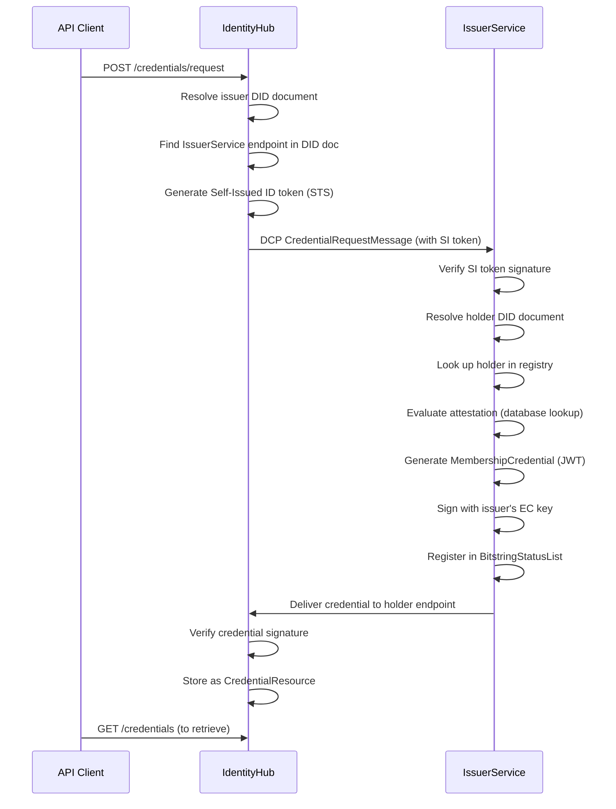

# Step 8 — Request Credentials (DCP Issuance)

[← Register Holder](07_register_holder.md) | [Next: Retrieve Credentials →](09_retrieve_credentials.md)

---

Trigger the actual DCP Issuance Flow. The IdentityHub (Holder) sends a credential request to the IssuerService.

## Request

```bash
curl -X POST "${IDH_URL}/api/identity/v1alpha/participants/${IDH_CONTEXT}/credentials/request" \
  -H "Content-Type: application/json" \
  -H "x-api-key: ${IDH_API_KEY}" \
  -d '{
    "issuerDid": "did:web:issuer-service.example.com",
    "holderPid": "did:web:issuer-service.example.com",
    "credentials": [
      {
        "id": "tx-membershipCredential",
        "type": "MembershipCredential",
        "format": "VC1_0_JWT"
      }
    ]
  }'
```

## Response

**201 Created**: Empty body on success.

## Request Fields

| Field | Description |
|-------|-------------|
| `issuerDid` | The DID of the issuer to request credentials from |
| `holderPid` | The participant ID at the issuer (match what was registered in [Step 7](07_register_holder.md) or use the issuer's DID) |
| `credentials[].id` | Must match the `id` of the credential definition created in [Step 6](06_create_credential_definition.md) |
| `credentials[].type` | Must match the `credentialType` of the credential definition |
| `credentials[].format` | Must match the `format` of the credential definition |

> **Note**: The issuance is **asynchronous**. After the request returns 201, the credential generation and delivery happen in the background. Wait a few seconds before querying for the credential.

## What Happens Behind the Scenes

This single API call triggers the full DCP protocol flow:



## Protocol Steps Explained

| Step | Component | Description |
|------|-----------|-------------|
| 1 | IdentityHub | Receives the API request and resolves the issuer's DID document |
| 2 | IdentityHub | Extracts the `IssuerService` endpoint from the DID document's `service` array |
| 3 | IdentityHub | Generates a Self-Issued (SI) ID token signed with the holder's private key |
| 4 | IdentityHub → IssuerService | Sends a DCP `CredentialRequestMessage` with the SI token |
| 5 | IssuerService | Verifies the SI token signature against the holder's DID document |
| 6 | IssuerService | Looks up the holder in the registry (from [Step 7](07_register_holder.md)) |
| 7 | IssuerService | Evaluates the attestation (from [Step 5](05_create_attestation.md)) |
| 8 | IssuerService | Generates and signs the credential using the issuer's private key |
| 9 | IssuerService | Registers the credential in a BitstringStatusList for revocation support |
| 10 | IssuerService → IdentityHub | Delivers the credential to the holder's `CredentialService` endpoint |
| 11 | IdentityHub | Verifies the credential signature and stores it as a `CredentialResource` |

---

[Next: Retrieve Credentials →](09_retrieve_credentials.md)

## NOTICE

This work is licensed under the [CC-BY-4.0](https://creativecommons.org/licenses/by/4.0/legalcode).

- SPDX-License-Identifier: CC-BY-4.0
- SPDX-FileCopyrightText: 2026 Contributors to the Eclipse Foundation
- SPDX-FileCopyrightText: 2026 Catena-X Automotive Network e.V.
- SPDX-FileCopyrightText: 2026 LKS Next
- Source URL: <https://github.com/eclipse-tractusx/tractusx-identityhub/blob/main/docs/usage/dcp-api-walkthrough/08_request_credentials.md>