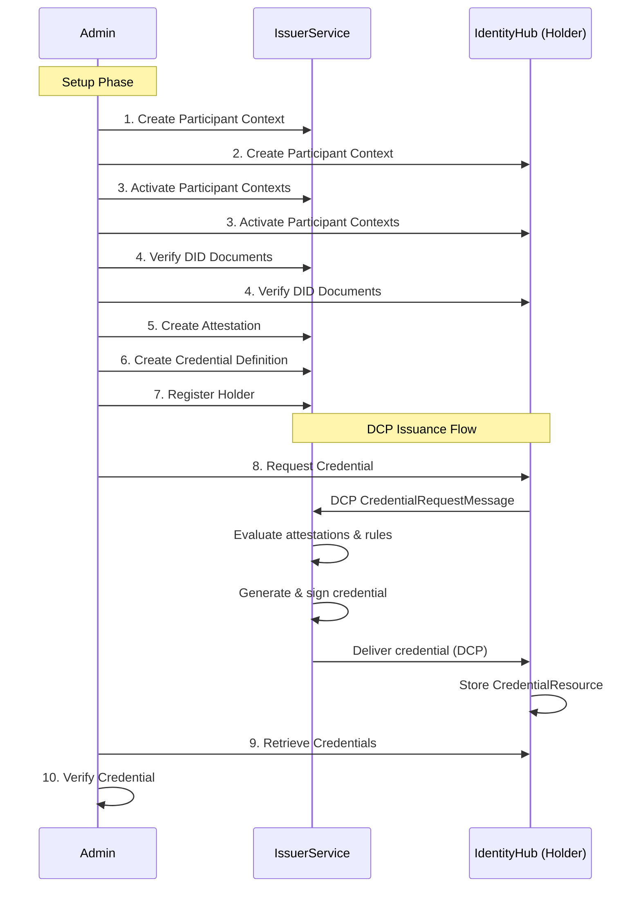

# DCP API Walkthrough

## Introduction

This walkthrough provides a step-by-step reference for systems integrators working with the **Decentralized Claims Protocol (DCP)** credential issuance flow using the Eclipse Tractus-X **IssuerService** and **IdentityHub**.

By the end of this walkthrough, you will have:
- Created and activated participant contexts for both the Issuer and the Holder
- Configured attestations and credential definitions on the Issuer
- Registered the Holder with the Issuer
- Requested and received a **MembershipCredential** via the DCP protocol
- Verified the issued credential

Both services implement the [DCP Specification v1.0.1](https://eclipse-dataspace-dcp.github.io/decentralized-claims-protocol/v1.0.1/) for credential issuance.

## Architecture

The DCP Issuance Flow involves two components acting as dataspace participants:

| Component | Role | Description |
|-----------|------|-------------|
| **IssuerService** | Credential Issuer | Issues verifiable credentials to holders based on configured rules and attestations |
| **IdentityHub** | Credential Holder | Stores and manages credentials, DIDs, and key pairs for a dataspace participant |



## Service Endpoints

**IssuerService:**

| Endpoint | Port | Path | Visibility | Purpose |
|----------|------|------|------------|---------|
| Default | 8081 | `/api` | Internal | General API |
| Issuance | 8082 | `/api/issuance` | Public | DCP credential request endpoint |
| DID | 8083 | `/` | Public | DID document resolution (`/.well-known/did.json`) |
| Version | 8084 | `/.well-known/api` | Internal | Runtime version info |
| STS | 8085 | `/api/sts` | Internal | Self-Issued ID token creation |
| Admin | 8086 | `/api/admin` | Internal | Manage attestations, definitions, holders |
| Identity | 8087 | `/api/identity` | Internal | Manage participants, DIDs, key pairs |
| StatusList | 8088 | `/statuslist` | Public | Credential revocation status lists |

**IdentityHub:**

| Endpoint | Port | Path | Visibility | Purpose |
|----------|------|------|------------|---------|
| Default | 8081 | `/api` | Internal | General API |
| Credentials | 8082 | `/api/credentials` | Public | DCP credential storage & presentation |
| DID | 8083 | `/` | Public | DID document resolution |
| Version | 8084 | `/.well-known/api` | Internal | Runtime version info |
| STS | 8085 | `/api/sts` | Internal | Self-Issued ID token creation |
| Identity | 8086 | `/api/identity` | Internal | Manage participants, DIDs, key pairs |

## Authentication

All management APIs use **API Key** authentication via the `x-api-key` header:

```
x-api-key: <participant-context-id>.<token>
```

The API key encodes both the participant context and the authorization token. The part before the first `.` is the base64url-encoded participant ID — this encoding is part of the API-key auth scheme and is unchanged in 0.17.0. It is **separate from URL path parameters**: as of 0.17.0 ([IH #937](https://github.com/eclipse-edc/IdentityHub/pull/937)), `participantContextId` path segments (e.g. `/v1alpha/participants/{id}`) use the plain participant ID, not a base64url-encoded value.

## Steps

| Step | Resource | Endpoint | Description |
|------|----------|----------|-------------|
| [Prerequisites](00_prerequisites.md) | — | — | Super-user API keys and environment setup |
| [Create Issuer Participant](01_create_issuer_participant.md) | Identity API | `POST /v1alpha/participants` | Create the Issuer's ParticipantContext on IssuerService |
| [Create Holder Participant](02_create_holder_participant.md) | Identity API | `POST /v1alpha/participants` | Create the Holder's ParticipantContext on IdentityHub |
| [Activate Participant Contexts](03_activate_participant_contexts.md) | Identity API | `PUT /v1alpha/participants/{id}/state` | Activate participant contexts so DID documents are published |
| [Verify DID Documents](04_verify_did_documents.md) | DID | `GET /.well-known/did.json` | Verify that DID documents are published and resolvable |
| [Create Attestation](05_create_attestation.md) | Admin API | `POST /v1alpha/participants/{id}/attestations` | Define how the IssuerService verifies holder claims |
| [Create Credential Definition](06_create_credential_definition.md) | Admin API | `POST /v1alpha/participants/{id}/credentialdefinitions` | Configure what credentials can be issued |
| [Register Holder](07_register_holder.md) | Admin API | `POST /v1alpha/participants/{id}/holders` | Register the IdentityHub as a known holder |
| [Request Credentials](08_request_credentials.md) | Identity API | `POST /v1alpha/participants/{id}/credentials/request` | Trigger the DCP credential issuance flow |
| [Retrieve Credentials](09_retrieve_credentials.md) | Identity API | `GET /v1alpha/participants/{id}/credentials` | Retrieve the issued credential from the IdentityHub |
| [Verify Credential](10_verify_credential.md) | — | — | Verify signature, temporal claims, and revocation status |

## API Reference

### Identity API (both services)

| Method | Path | Description |
|--------|------|-------------|
| `POST` | `/v1alpha/participants` | Create a new participant context |
| `GET` | `/v1alpha/participants/{id}` | Get participant context details |
| `PUT` | `/v1alpha/participants/{id}/state?isActive=true` | Activate/deactivate participant |
| `POST` | `/v1alpha/participants/{id}/credentials/request` | Request credentials from an issuer |
| `GET` | `/v1alpha/participants/{id}/credentials` | List credentials for a participant |

### Issuer Admin API (IssuerService only)

| Method | Path | Description |
|--------|------|-------------|
| `POST` | `/v1alpha/participants/{id}/attestations` | Create an attestation definition |
| `POST` | `/v1alpha/participants/{id}/credentialdefinitions` | Create a credential definition |
| `POST` | `/v1alpha/participants/{id}/holders` | Register a holder |
| `GET` | `/v1alpha/participants/{id}/issuanceprocesses/query` | Query issuance process status |
| `POST` | `/v1alpha/participants/{id}/credentials/{credId}/revoke` | Revoke a credential |

## Further Reading

- [DCP Specification v1.0.1](https://eclipse-dataspace-dcp.github.io/decentralized-claims-protocol/v1.0.1/)
- [IssuerService Developer Docs](../../developers/components/IssuerService.md)
- [IdentityHub Developer Docs](../../developers/components/IdentityHub.md)
- [Upstream OpenAPI Documentation](https://eclipse-edc.github.io/IdentityHub/openapi/)
- [W3C Verifiable Credentials v1.0](https://www.w3.org/TR/vc-data-model/)
- [W3C Bitstring Status List v1.0](https://www.w3.org/TR/vc-bitstring-status-list/)
- [did:web Method Specification](https://w3c-ccg.github.io/did-method-web/)

## NOTICE

This work is licensed under the [CC-BY-4.0](https://creativecommons.org/licenses/by/4.0/legalcode).

- SPDX-License-Identifier: CC-BY-4.0
- SPDX-FileCopyrightText: 2026 Contributors to the Eclipse Foundation
- SPDX-FileCopyrightText: 2026 Catena-X Automotive Network e.V.
- SPDX-FileCopyrightText: 2026 LKS Next
- Source URL: <https://github.com/eclipse-tractusx/tractus-x-identityhub>
